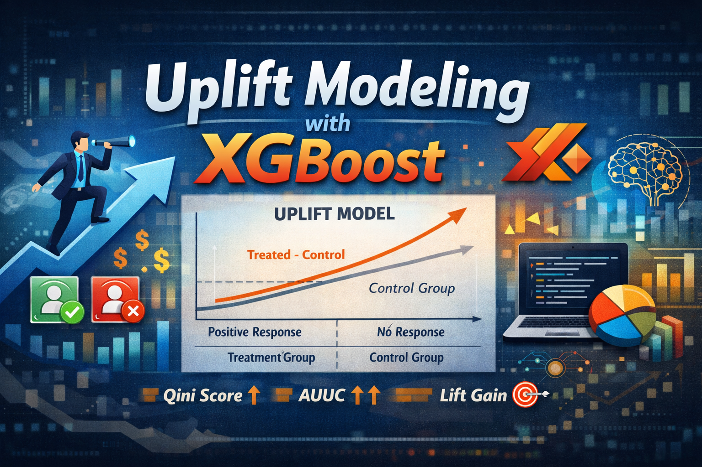

# Customer Uplift Modeling Using Causal Machine Learning (XGBoost S-Learner)



## Project Overview

This project demonstrates **uplift modeling**, a machine learning technique designed to identify **which customers are most likely to respond positively to a business action**, such as a promotion, coupon, or marketing campaign. Unlike traditional supervised learning, which predicts outcomes (e.g., purchase), uplift modeling predicts the **incremental effect of a treatment** — answering the question:

> “If we give this customer a promotion, how much more likely are they to convert compared to if we do nothing?”

This is particularly valuable for **costly interventions**, where targeting the right subset of customers maximizes ROI.

---

## Business Motivation

Marketing campaigns are expensive. Giving discounts or promotions to every customer can reduce profit margins. By identifying **“persuadables”** — customers who would respond positively only if treated — businesses can:

* Increase conversion rate
* Reduce wasted marketing spend
* Avoid negatively impacting disengaged or adverse segments ("sleeping dogs")

This project simulates such a scenario using a **synthetic experimental dataset**.

---

## Data

* **Source:** Synthetic dataset from Zhao et al., 2020 ([link](https://zenodo.org/records/3653141#.XwEVz5NKjYU))
* **Size:** 10,000 rows
* **Columns:**

  | Column Type               | Description                                                           |
  | ------------------------- | --------------------------------------------------------------------- |
  | `treatment_group_key`     | Indicates if customer received treatment (`0`=control, `1`=treatment) |
  | `conversion`              | Binary outcome (1 if customer purchased, 0 otherwise)                 |
  | `x1-x10_informative`      | Features predictive of outcome                                        |
  | `x11-x30_irrelevant`      | Noise / irrelevant features                                           |
  | `x31-x36_uplift_increase` | Features predictive of treatment effect                               |

The dataset represents a **randomized controlled experiment**, a requirement for estimating **Individual Treatment Effects (ITE)** and Conditional Average Treatment Effects (CATE).

---

## Data Science Skills Highlighted

This project demonstrates:

| Skill Area                            | Description                                                                      |
| ------------------------------------- | -------------------------------------------------------------------------------- |
| **Causal Machine Learning**           | Using uplift modeling to identify incremental treatment effects                  |
| **Python / Pandas / NumPy**           | Data wrangling, exploratory data analysis                                        |
| **Scikit-learn / XGBoost**            | Model training, binary classification, S-Learner approach                        |
| **Experimental Design / A/B Testing** | Estimating Average Treatment Effect (ATE) and validating experiments             |
| **Model Evaluation**                  | Quantile metrics, cumulative gain charts, uplift score visualization             |
| **Visualization**                     | Matplotlib for uplift distributions, quantile charts, and cumulative gain curves |

---

## Experimental Results

* **Overall conversion rate:** 31.9%
* **Conversion rate by group:**

| Group     | Conversion Rate | Count |
| --------- | --------------- | ----- |
| Control   | 26.7%           | 5000  |
| Treatment | 37.1%           | 5000  |
| **ATE**   | **10.4%**       | —     |

* **Significance test:**

  ```python
  proportions_ztest(count=[1335, 1856], nobs=[5000, 5000])
  ```

  p-value ≈ 5.27e-29 → treatment effect is statistically significant.

---

## Modeling Approach

* **Model:** `XGBClassifier` (S-Learner)

* **Training strategy:**

  * Features include both treatment indicator and customer features
  * 80/20 train-validation split
  * Early stopping on validation AUC

* **Uplift Calculation:**

  ```python
  Uplift = model.predict_proba(X_valid_1)[:,1] - model.predict_proba(X_valid_0)[:,1]
  ```

---

## Evaluation Metrics

1. **Quantile Uplift Chart:**

   * Data split into 10 deciles based on predicted uplift
   * True uplift calculated for each decile (treatment conversion – control conversion)

| Quantile     | True Uplift |
| ------------ | ----------- |
| 1 (lowest)   | -0.017      |
| 2            | 0.034       |
| 3            | -0.005      |
| 4            | 0.022       |
| 5            | 0.134       |
| 6            | 0.065       |
| 7            | 0.077       |
| 8            | 0.089       |
| 9            | 0.121       |
| 10 (highest) | 0.351       |

* **Insights:**

  * Targeting the **top decile** can achieve a **treatment effect of 35%**, far above the average ATE of 10%
  * Bottom decile shows **negative uplift**, confirming the “sleeping dog” effect

2. **Cumulative Gain Chart:**

   * Shows cumulative incremental conversions captured as more customers are targeted by descending uplift score
   * Validates that prioritizing high-uplift customers maximizes ROI

---

## Graphs & Interpretation

* **Histogram of Uplift Scores:**
  Reveals distribution of incremental effect across customers
* **Uplift Quantile Chart:**
  Shows relationship between predicted uplift deciles and actual treatment effect
* **Cumulative Gain Curve:**
  Demonstrates practical ROI if top-N customers are targeted

These visualizations help **communicate actionable insights** to stakeholders.

---

## Key Takeaways

* Uplift modeling **goes beyond traditional A/B testing**, allowing precise targeting of customers most likely to respond to treatment.
* Using S-Learner XGBoost, we can **predict individual incremental effects** from features.
* Validation shows that targeting the **top uplift decile** can **triple the effectiveness** of treatment relative to random targeting.
* Graphs and quantile analysis **visualize the value of data-driven targeting**.

---

